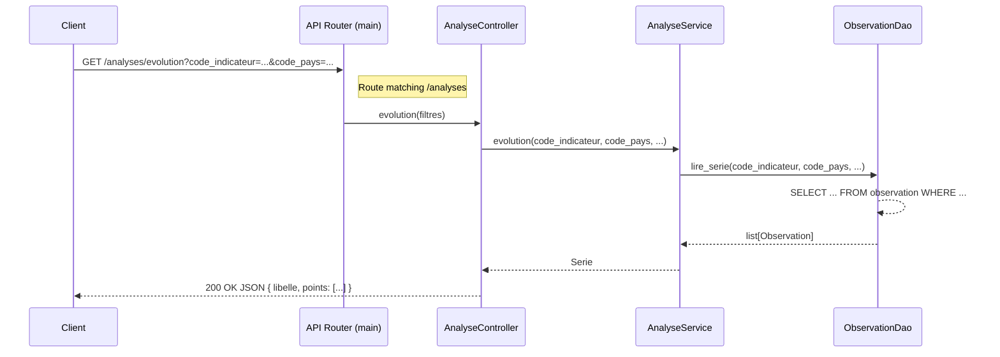

# Backend - LaborScope API

Core of the application: a layered REST API built with [FastAPI](https://fastapi.tiangolo.com/)
that collects, stores and analyses labour-market statistics from the
[ILOSTAT](https://ilostat.ilo.org/) open data, with user management and PDF reporting.

## 🚀 Run the application

Commands to run from the repository's root directory:

- Install all dependencies: `uv sync --project backend --all-extras`
  - option all-extras: including dev dependencies
- Launch the API in development mode: `uv run --project backend python backend/src/main.py`

:bulb: On first launch, initialize the database with the SQL files in `data/`
(`init_db.sql` for the tables, then `pop_referentiels.sql` for the reference data).

## 🏛️ Architecture

The backend follows a **Layered Architecture** (N-Tier) to ensure separation of concerns
and maintainability. Dependencies always point downwards:

```
controller  →  service  →  dao  →  business_object
```

- **Business Object** (`business_object/`) : pure domain entities, **one class per file**,
  no logic (data holders). Enumerations live in `enums.py`.
- **Controller** (`controller/`) : HTTP routing via FastAPI, **no computation**.
- **Model** (`model/`) : API data contracts via [Pydantic](https://pydantic.dev/) (request/response).
- **Service** (`service/`) : the business logic (collection, parsing, analysis, auth, admin, reports).
- **Client** (`client/`) : the only module that calls the external ILOSTAT API.
- **DAO** (`dao/`) : database access, one DAO per entity, on top of `db_connection.py`.
- **Utils** (`utils/`) : cross-cutting tools (config, security, scheduler, PDF, charts, logging).

### Project structure

```text
backend/
├── Dockerfile                      # Container image for the API
├── logging_config.yml              # Structured logging configuration
├── pyproject.toml                  # Project metadata & dependencies (uv)
├── uv.lock                         # Pinned dependency versions
│
├── src/
│   ├── main.py                     # FastAPI app : wires routers, starts the scheduler
│   │
│   ├── business_object/            # Domain entities (one class per file, no logic)
│   │   ├── enums.py                #   Role, Sexe, TypeClassification, StatutImport, StatutRapport
│   │   ├── utilisateur.py          #   Utilisateur : compte applicatif
│   │   ├── pays.py                 #   Pays : code_pays + nom_pays
│   │   ├── indicateur.py           #   Indicateur ILOSTAT
│   │   ├── classification.py       #   Classification (base : age ou occupation)
│   │   ├── age.py                  #   Age(Classification) : age_min / age_max
│   │   ├── occupation.py           #   Occupation(Classification) : code ISCO
│   │   ├── observation.py          #   Observation : valeur mesurée (+ sexe, import_id)
│   │   ├── import_donnees.py       #   ImportDonnees : trace d'un import
│   │   ├── journal_activite.py     #   JournalActivite : action sensible tracée
│   │   └── rapport.py              #   Rapport : rapport PDF demandé
│   │
│   ├── controller/                 # HTTP routes (FastAPI), no computation
│   │   ├── dependances.py          #   Dépendances auth : utilisateur courant, exiger_connexion/admin
│   │   ├── auth_controller.py      #   Inscription, connexion, profil courant
│   │   ├── referentiel_controller.py #  Listes : indicateurs, pays, classifications
│   │   ├── analyse_controller.py   #   Évolution (libre), comparaisons, carte
│   │   ├── rapport_controller.py   #   Demande, liste, téléchargement des rapports PDF
│   │   └── admin_controller.py     #   Imports, données, comptes, journal
│   │
│   ├── model/                      # Pydantic schemas (API in/out)
│   │   ├── auth_model.py           #   Identifiants (in), Jeton (out)
│   │   ├── utilisateur_model.py    #   Création (in), sortie sans mot de passe (out)
│   │   ├── analyse_model.py        #   Filtres (in), séries & comparaisons (out)
│   │   ├── import_model.py         #   Résultat d'un import (out)
│   │   └── rapport_model.py        #   Demande (in), rapport (out)
│   │
│   ├── service/                    # Business logic (features F1–F6, FO3)
│   │   ├── collecte_service.py     #   F1 : télécharge, parse, enregistre, trace l'import
│   │   ├── parser_service.py       #   F2 : CSV/JSON → Observation, rejette l'invalide
│   │   ├── referentiel_service.py  #   Listes d'indicateurs, pays, classifications
│   │   ├── analyse_service.py      #   F3/F4/F5 + carte : séries et comparaisons
│   │   ├── authentification_service.py #  F6 : mot de passe, jeton, contrôle de rôle
│   │   ├── utilisateur_service.py  #   F6 : inscription, promotion admin, désactivation
│   │   ├── donnees_service.py      #   F6 : recherche, correction, suppression (admin)
│   │   ├── journal_service.py      #   F6 : enregistre et consulte le journal
│   │   └── rapport_service.py      #   FO3 : assemble séries + graphiques + PDF
│   │
│   ├── client/
│   │   └── ilostat_client.py       # Seul appel à l'API ILOSTAT (contenu brut)
│   │
│   ├── dao/                        # Database access (one DAO per entity)
│   │   ├── db_connection.py        #   Connexion PostgreSQL unique (singleton)
│   │   ├── indicateur_dao.py       #   Lecture / création des indicateurs
│   │   ├── pays_dao.py             #   Lecture / création des pays
│   │   ├── classification_dao.py   #   Lecture / création des classifications
│   │   ├── observation_dao.py      #   Upsert par lot, lecture série/période, modif, suppr.
│   │   ├── import_dao.py           #   Enregistre et liste les imports
│   │   ├── utilisateur_dao.py      #   Crée, recherche, modifie les comptes
│   │   ├── journal_dao.py          #   Écrit et lit le journal
│   │   └── rapport_dao.py          #   Enregistre et liste les rapports
│   │
│   └── utils/                      # Cross-cutting tools
│       ├── config.py               #   Lecture du fichier .env
│       ├── securite.py             #   Hachage mot de passe, jetons
│       ├── journalisation.py       #   Logs techniques + décorateur @log + middleware
│       ├── planificateur.py        #   Déclenche la collecte périodique
│       ├── graphiques.py           #   Courbes / barres pour le PDF
│       ├── pdf.py                  #   Mise en page du rapport
│       ├── exceptions.py           #   Erreurs métier communes
│       ├── singleton.py            #   Métaclasse Singleton
│       └── reset_database.py       #   Recrée la base pour les tests
│
└── tests/                          # Tests organised by layer
    ├── conftest.py                 #   Charge les variables d'environnement
    ├── business_object/
    ├── dao/
    └── service/
```

> Data lives at the repository root in `data/` : `init_db.sql` (tables + unique constraint
> on `observation`), `pop_referentiels.sql` (pays, classifications, the two indicators),
> `pop_db_test.sql` (fixtures for DAO tests).

### Layers

Sequence diagram of the time-series analysis flow (F3, free access) through the layers:



Full class diagrams (Mermaid, importable in Lucidchart) are in `doc/` :
`class_diagram_domaine.mmd` (domain model + inheritance) and
`class_diagram_couches.mmd` (service/DAO layers + methods + composition).

### Config files

In both the backend and frontend folders, you will find:

| Item                  | Description                                         |
| --------------------- | --------------------------------------------------- |
| logging_config.yml    | Configuration for the structured logging system.    |
| pyproject.toml        | Project metadata and dependency definitions.        |
| uv.lock               | Lockfile that ensures reproducible environments by pinning exact dependency versions. |
| \_\_init\_\_.py       | Marks a directory as a Python package, enabling module imports. |

## ⚒️ Development toolkit

### Debugging & Logs

The application uses a structured logging system. Logs are written to the `backend/logs/`
directory and follow the format defined in `logging_config.yml`.

A custom `@log` decorator (in `utils/journalisation.py`) automatically logs method inputs and
outputs, making it much easier to trace the flow of data through the services.

### Unit tests

To ensure tests are repeatable, safe, and **do not interfere with the real database**, we use
a dedicated schema for unit testing. The DAO unit tests use data from the `data/pop_db_test.sql`
file, loaded into a separate schema (`project_test_dao`) so as not to pollute the other data.
Tests are organised by layer under `tests/` (`business_object/`, `dao/`, `service/`).

- [ ] Launch unit tests: `uv run --project backend pytest -v`

It is also possible to generate test coverage using [Coverage](https://coverage.readthedocs.io/en/):

- [ ] `uv run --project backend coverage run -m pytest backend`
- [ ] `uv run --project backend coverage report -m`
- [ ] `uv run --project backend coverage html`
  - Download and open coverage_report/index.html

### Ruff

The **format on save** with [Ruff](https://docs.astral.sh/ruff/) is enabled by default in the
workspace (cf. *.vscode/settings.json*).

To do it manually:

- ensures consistent and readable code style: `uv run --project backend ruff format backend/`
- identifies and fixes potential issues: `uv run --project backend ruff check --fix backend/`

### Pylint

Static analysis with **pylint**: `uv run --project backend --extra dev pylint --output-format=colorized --disable=C0114,C0411,C0415,W0718 $(git ls-files 'backend/**/*.py') --fail-under=7.5`
